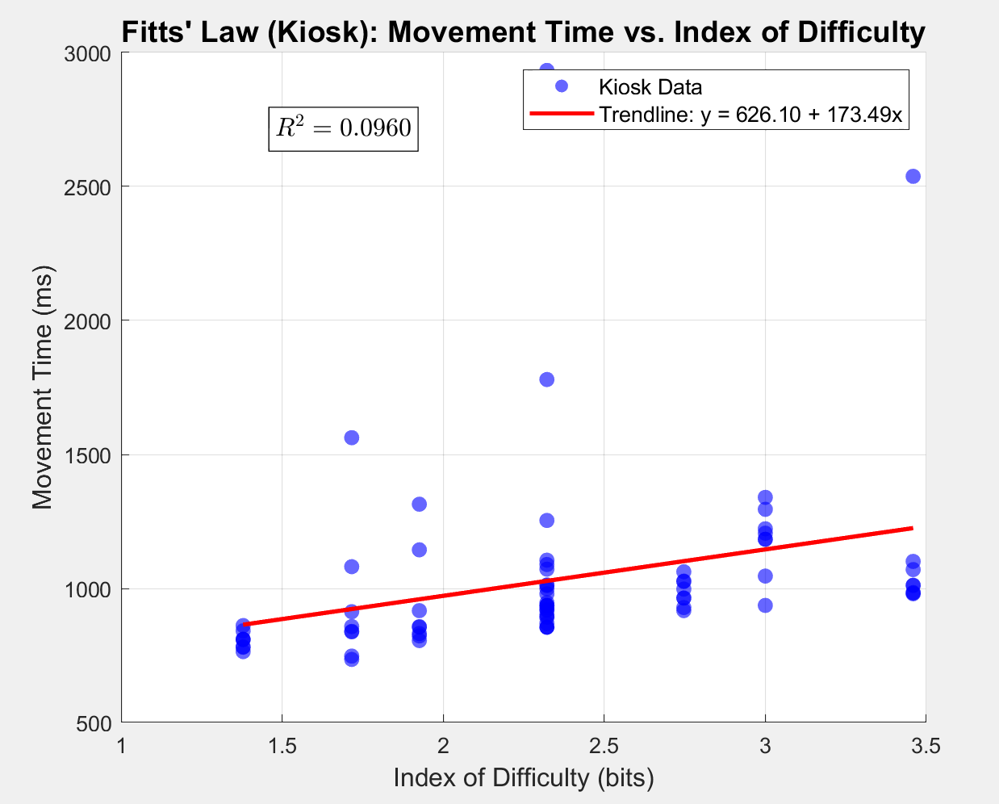

# Fitts' Law Experiment — McDonald's Self-Order Kiosk

 **HTML application:**  https://plusone0621.github.io/fitts-law-kiosk/

---

## Scenario & Innovation & Application
This experiment simulates a Mcdonald's kiosk to test Fitts' Law on large touchscreens. To focus only on movement time, I used a simple UI with a fixed Home button and targets of different sizes and distances. The results show that putting large, often-used buttons in the lower-middle area helps users click faster and more accurately.

---

## Custom Fitts' Law Formula

```
MT = 626.10 + 173.49 × log2(A/W + 1)
```

---
## Screen Recording

> TODO：把 mp4 影片拖進任一個 Issue 或 Discussion 的輸入框，GitHub 會自動產生一個 `https://github.com/user-attachments/assets/...` 的連結，把那個連結整行貼在下面（不用發布 Issue，也不需要 `[]()` 包起來，單獨一行就會自動變成可播放的嵌入式影片）。

https://github.com/user-attachments/assets/貼上你的影片連結

## Empirical Analysis



